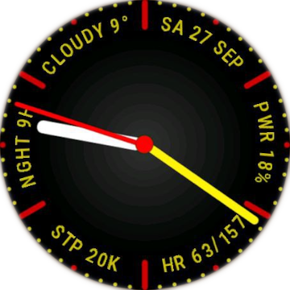

# Zepp OS Watchface – Hands

A round watchface for Zepp OS with focus on readability and performance! Adapted for Zepp OS smartwatches and designed to match the **Amazfit Cheetah Round** aesthetic.
Based on the original **Horizon** watchface from [novvember/amazfit-watchfaces](https://github.com/novvember/amazfit-watchfaces).  

## Features

- **Clean, minimal design** with high readability and no clutter
- **Analog display** with hour, minute, and second hands
- **Always-On Display (AOD)** supported
- **Edge widgets** showing:
  - Date
  - Current weather
  - Battery level
  - Current and maximum heart rate
  - Step counter
  - Time till next to sunset or sunrise
- **Color palette** designed to match the Amazfit Cheetah Round
- **Multilanguage** support: English, Russian, Deutch and Spanish languages are supported!

## Installation

To install the watchface on your Zepp OS device:

1. Clone or download this repository.
2. Build and deploy using the [Zepp OS Developer Tools](https://zepp-os.github.io/docs/).
3. Follow the sideloading instructions provided in the Zepp OS documentation.

## Credits

This watchface is a derivative work based on:

- **Horizon Watchface** by [novvember](https://github.com/novvember/amazfit-watchfaces)

## License

This project is licensed under the [GNU General Public License v3.0 (GPL-3.0)](LICENSE).

---

> ⚠️ This project is not affiliated with or endorsed by Zepp Health Corporation or Amazfit.

